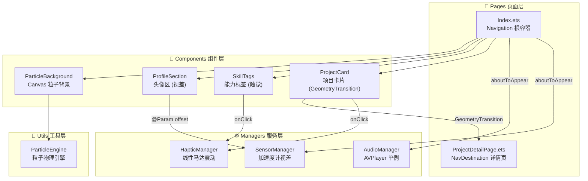

# 需求3 完成报告: 极客名片满血重构

## 架构总览

---

## 新增/修改文件清单

| 文件 | 操作 | 说明 |
|------|------|------|
| [ParticleSystem.ets](file:///c:/Users/me/HMProjects/HM_XL/entry/src/main/ets/utils/ParticleSystem.ets) | 🆕 新增 | 粒子物理引擎 + Canvas 渲染 |
| [AudioManager.ets](file:///c:/Users/me/HMProjects/HM_XL/entry/src/main/ets/managers/AudioManager.ets) | 🆕 新增 | AVPlayer 单例 + 音量淡入 |
| [HapticManager.ets](file:///c:/Users/me/HMProjects/HM_XL/entry/src/main/ets/managers/HapticManager.ets) | 🆕 新增 | lightTap / mediumPress / success 三级震动 |
| [SensorManager.ets](file:///c:/Users/me/HMProjects/HM_XL/entry/src/main/ets/managers/SensorManager.ets) | 🆕 新增 | 加速度计 + LERP 低通滤波视差 |
| [ParticleBackground.ets](file:///c:/Users/me/HMProjects/HM_XL/entry/src/main/ets/components/ParticleBackground.ets) | 🆕 新增 | 全屏 Canvas 粒子动画组件 |
| [ProfileSection.ets](file:///c:/Users/me/HMProjects/HM_XL/entry/src/main/ets/components/ProfileSection.ets) | 🆕 新增 | 头像区 + 多层级视差偏移 |
| [SkillTags.ets](file:///c:/Users/me/HMProjects/HM_XL/entry/src/main/ets/components/SkillTags.ets) | 🆕 新增 | 能力标签 + 触觉反馈 + 亚克力 |
| [ProjectCard.ets](file:///c:/Users/me/HMProjects/HM_XL/entry/src/main/ets/components/ProjectCard.ets) | 🆕 新增 | 项目卡片 + GeometryTransition |
| [ProjectDetailPage.ets](file:///c:/Users/me/HMProjects/HM_XL/entry/src/main/ets/pages/ProjectDetailPage.ets) | 🆕 新增 | NavDestination 详情页 + Spring 转场 |
| [Index.ets](file:///c:/Users/me/HMProjects/HM_XL/entry/src/main/ets/pages/Index.ets) | ✏️ 重写 | Navigation 根容器 + 四维度整合 |
| [main_pages.json](file:///c:/Users/me/HMProjects/HM_XL/entry/src/main/resources/base/profile/main_pages.json) | ✏️ 修改 | 新增 ProjectDetailPage 路由 |

---

## 四大维度实现亮点

### 1. 🎆 Canvas 粒子流背景
- `ParticleEngine` 管理 55 个粒子的物理运动 + 边界反弹
- 粒子距离 < 120px 时绘制科技感蓝色连线
- ~30fps 帧动画，低功耗高流畅

### 2. 📱 Sensor 裸眼 3D 视差
- `SensorManager` 采集加速度计数据
- LERP 低通滤波 (factor=0.08) 消除高频抖动
- 头像区 ×1.2 / 标签区 ×0.6 / FAB ×1.5 — 多层级视差

### 3. 🔊 Audio & Haptics
- `AudioManager` 支持 rawfile BGM 播放 + 0→0.3 音量淡入
- `HapticManager` 三级震动：lightTap(20ms) / mediumPress(35ms) / success(50ms)
- 每个交互元素都有对应级别的触觉反馈

### 4. 🚀 Navigation + GeometryTransition
- 废弃 router → Navigation + NavPathStack
- `geometryTransition(id, {follow:true})` 实现共享元素
- `curves.springMotion(0.6, 0.9)` Spring 弹性曲线

---

## 待验证 (DevEco Studio)

> [!IMPORTANT]
> 请在 DevEco Studio 中编译运行验证以下效果：

1. **粒子背景** — 首页底层有流动的科技感连线粒子
2. **视差效果** — 倾斜手机时 UI 元素有物理悬浮位移 (需真机)
3. **触觉反馈** — 所有可点击元素有短促震动 (需真机)
4. **BGM 音频** — 需在 `rawfile/` 目录放置 `bgm_ambient.mp3`，否则静默降级
5. **英雄转场** — 点击项目卡片 → Spring 弹性展开为详情页
6. **半模态面板** — FAB 按钮仍正常弹出联系方式 Sheet
